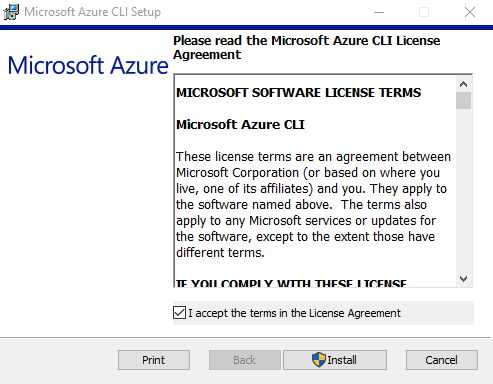
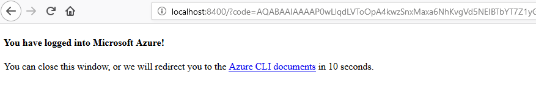
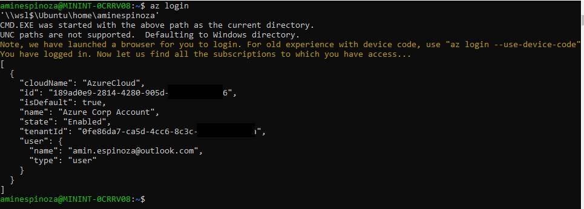

# Instalación de Azure CLI

### Instalación en Ubuntu o Debian

Este tutorial está diseñado para trabajar con la línea de comandos de Ubuntu y su gestor de paquetes.

Únicamente necesitas un solo comando.
```b
curl -sL https://aka.ms/InstallAzureCLIDeb | sudo bash
```
Este comando básicamente descarga un script y lo ejecuta, no necesitas hacer nada más. Si quieres saber cuáles son los pasos uno a uno puedes descargar este archivo (una muy buena manera de aprender también) o puedes, también ejecutar los pasos manuales.

El primer paso es obtener los paquetes requeridos
```b
sudo apt-get update
sudo apt-get install ca-certificates curl apt-transport-https lsb-release gnupg
```
Descarga la llave de seguridad y después instala
```b
curl -sL https://packages.microsoft.com/keys/microsoft.asc | \
    gpg --dearmor | \
    sudo tee /etc/apt/trusted.gpg.d/microsoft.asc.gpg > /dev/null
```
Ve con el repositorio de la CLI
```b
AZ_REPO=$(lsb_release -cs)
echo "deb [arch=amd64] https://packages.microsoft.com/repos/azure-cli/ $AZ_REPO main" | \
    sudo tee /etc/apt/sources.list.d/azure-cli.list
```
Actualiza la información del repositorio e instala
```b
sudo apt-get update
sudo apt-get install azure-cli
```
### Instalación en Windows

Ya lo sabes, en Windows todo va con asistentes de intalación descarga desde [este enlace](https://aka.ms/installazurecliwindows).



Aquí solo basta que abras una línea de comandos y todo estará preparado.

### La autenticación

Cualquiera de los dos pasos que hayas querido tomar te llevará al siguiente paso. El siguiente comando es para tener acceso a tu cuenta.
```b
az login
```
Una ventana de explorador se abrirá y después de ingresar tu cuenta entonces se mostrará en el explorador una imagen como esta:



En tu línea de comandos, el resultado será así:



¡Listo! Podremos avanzar en nuestro trabajo.

